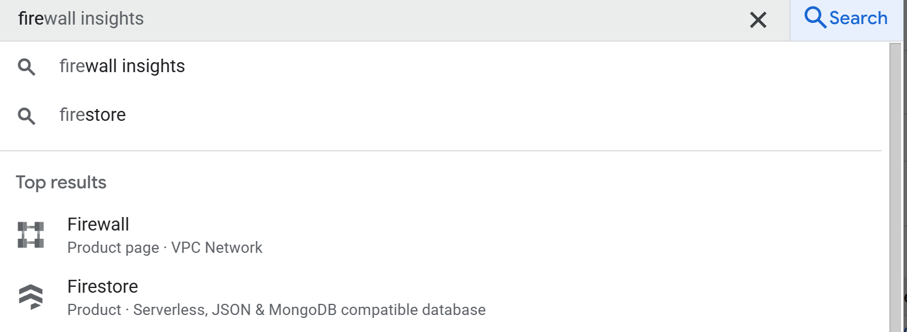
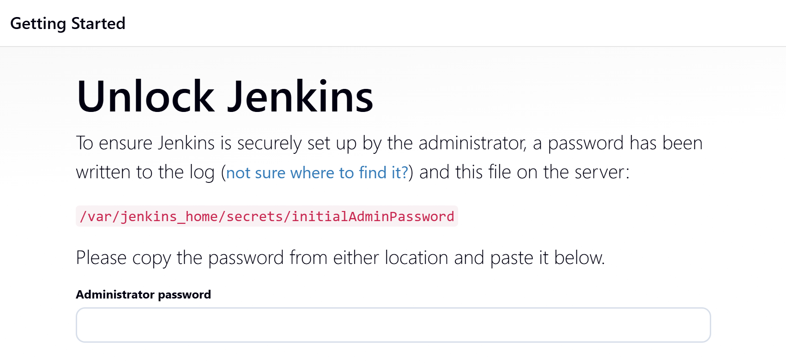
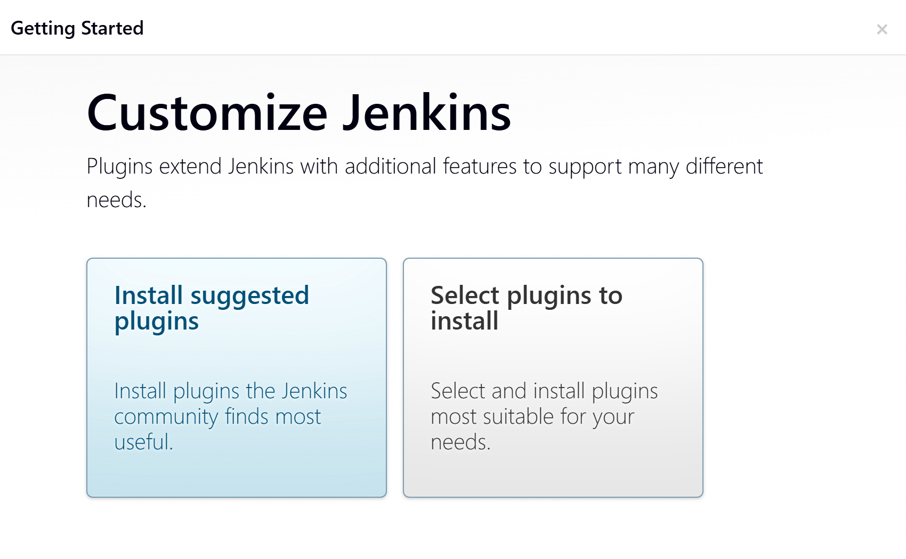
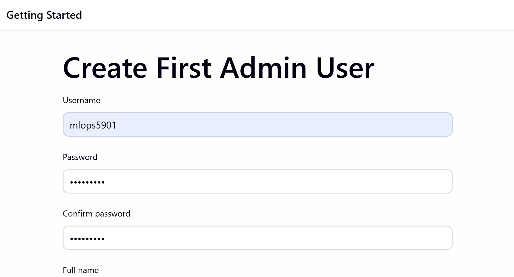
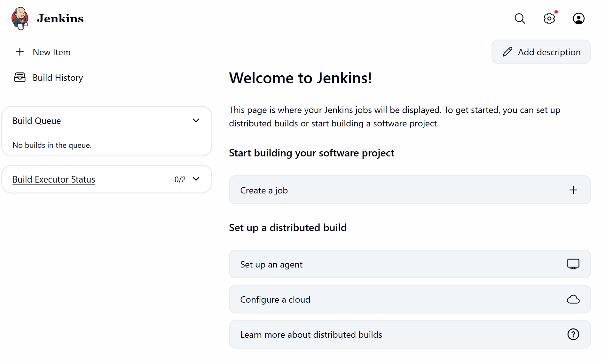
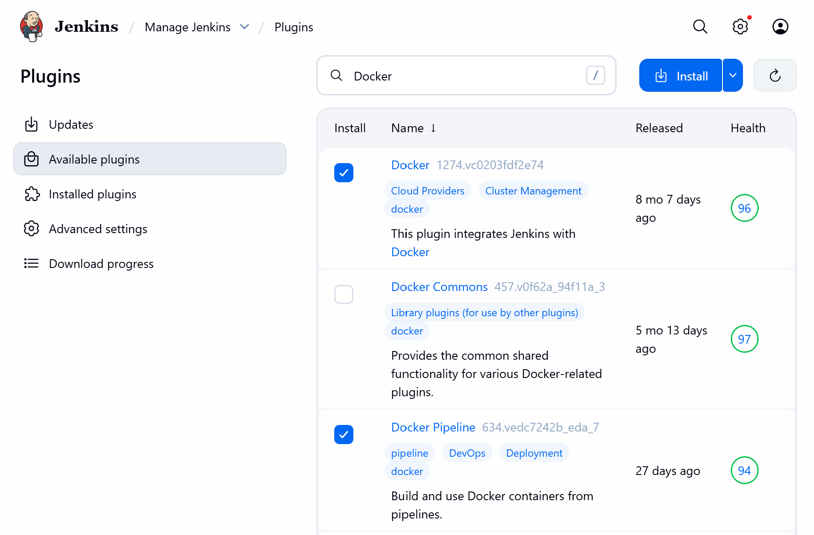
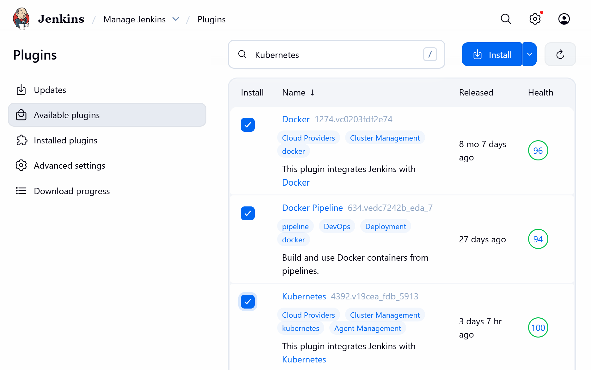

# ⚙️ **Jenkins Setup on GCP VM using Docker-in-Docker (DinD)**

In this stage, you will set up **Jenkins** inside your **GCP virtual machine** using a **Docker-in-Docker (DinD)** configuration.
This allows Jenkins to run in its own container while having access to the Docker daemon — enabling it to build and deploy containers directly.

## 🧩 **1️⃣ Ensure Minikube and Jenkins Share the Same Network**

Before running Jenkins, ensure it operates on the **same Docker network** as **Minikube**.
Run the following command in your **VM instance terminal**:

```bash
docker run -d --name jenkins \
-p 8080:8080 \
-p 50000:50000 \
-v /var/run/docker.sock:/var/run/docker.sock \
-v $(which docker):/usr/bin/docker \
-u root \
-e DOCKER_GID=$(getent group docker | cut -d: -f3) \
--network minikube \
jenkins/jenkins:lts
```

Expected output:

```bash
cae3b572364a: Pull complete 
11c82e82e8c5: Pull complete 
6d8ebcba18e6: Pull complete 
e29665228ac2: Pull complete 
cc05fa07d253: Pull complete 
7c2b9fc47dae: Pull complete 
9e58f885f660: Pull complete 
51148860bddf: Pull complete 
eba243d676e4: Pull complete 
04e220b291b8: Pull complete 
b9bcce170b58: Pull complete 
606dcc9d6add: Pull complete 
Digest: sha256:f2519b99350faeaaeef30e3b8695cd6261a5d571c859ec37c7ce47e5a241458d
Status: Downloaded newer image for jenkins/jenkins:lts
4c0400a1a6f1d06d47dcd8c645bf477f51ffb2db99d250ffb06dc35b25795dea
```

Check your running containers:

```bash
docker ps
```

You should now see both **minikube** and **jenkins** containers running.

## 🧠 **2️⃣ Retrieve the Jenkins Admin Password**

To get the password required for the initial Jenkins login, run:

```bash
docker logs jenkins
```

Look for this line in the output:

```bash
[LF]> Jenkins initial setup is required. An admin user has been created and a password generated.
[LF]> Please use the following password to proceed to installation:
[LF]> 
[LF]> bf98ea15f0664d158749e387bdd48970
```

Copy the password (the alphanumeric code at the bottom).

## 🌐 **3️⃣ Configure Firewall Rules in GCP**

We need to open port **8080** (used by Jenkins) to external traffic.

In the **GCP Console**:

1. In the top search bar, type **Firewall** and select the **Firewall service**.

<p align="center">
  
</p>

2. Click **Create Firewall Rule**.
3. Use the following configuration:

   * **Name:** `allow-mlops`
   * **Target:** All instances in the network
   * **Source IPv4 ranges:** `0.0.0.0/0`
   * **Protocols and ports:** Select **Allow all**
4. Click **Create**

This firewall rule allows external access to port **8080**, which Jenkins uses.

## 🚀 **4️⃣ Access Jenkins in the Browser**

1. In GCP, navigate to **VM Instances**.
2. Copy the **External IP** of your VM.
3. Open your browser and go to:

```
http://<YOUR_VM_EXTERNAL_IP>:8080
```

You should see the Jenkins setup page:

<p align="center">
  
</p>

Paste the **password** you retrieved earlier and click **Continue**.

## 🧩 **5️⃣ Install Plugins and Create Admin User**

### Step 1 — Install Suggested Plugins

When prompted, select the **Install suggested plugins** option.

<p align="center">
  
</p>

### Step 2 — Create Admin User

Fill in your desired username, password, and email to create your first admin user.

<p align="center">
  
</p>

### Step 3 — Save and Finish

After completing the setup, select **Save and Finish**, then click **Start using Jenkins**.

You should now see your Jenkins dashboard:

<p align="center">
  
</p>

Dismiss any warnings that appear.

## 🔧 **6️⃣ Install Required Jenkins Plugins**

1. From the left sidebar, click **Manage Jenkins** (gear icon).
2. Select **Plugins**.
3. In the **Available plugins** tab, search for and select:

   * `Docker`
   * `Docker Pipeline`

<p align="center">
  
</p>

4. Then search for and select:

   * `Kubernetes`

<p align="center">
  
</p>

5. Click **Install without restart** to install all three.

## 🔁 **7️⃣ Restart Jenkins**

After plugin installation, restart Jenkins to apply changes:

```bash
docker restart jenkins
```

Refresh your Jenkins dashboard in the browser and log back in.

## 🧱 **8️⃣ Set Up Python Inside Jenkins Container**

Enter the Jenkins container’s shell:

```bash
docker exec -it jenkins bash
```

Then, install Python and supporting tools:

```bash
apt update -y
apt install -y python3
python3 --version
ln -s /usr/bin/python3 /usr/bin/python
python --version
apt install -y python3-pip
apt install -y python3-venv
exit
```

Restart Jenkins again:

```bash
docker restart jenkins
```

## ✅ **9️⃣ Jenkins Setup Complete**

You have successfully:

* Launched Jenkins on your GCP VM using **Docker-in-Docker**
* Configured **GCP Firewall rules** for external access
* Installed essential plugins (**Docker**, **Docker Pipeline**, **Kubernetes**)
* Set up **Python** within the Jenkins container

Your Jenkins environment is now ready to automate CI/CD tasks for the **MLOps Machine Maintenance** project.
