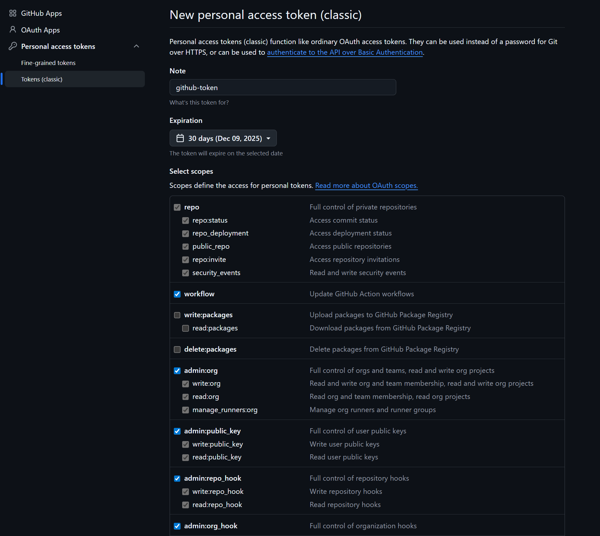
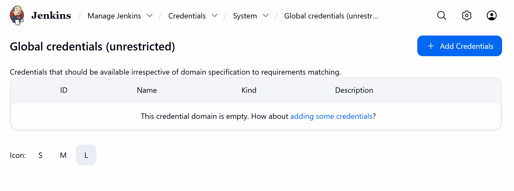
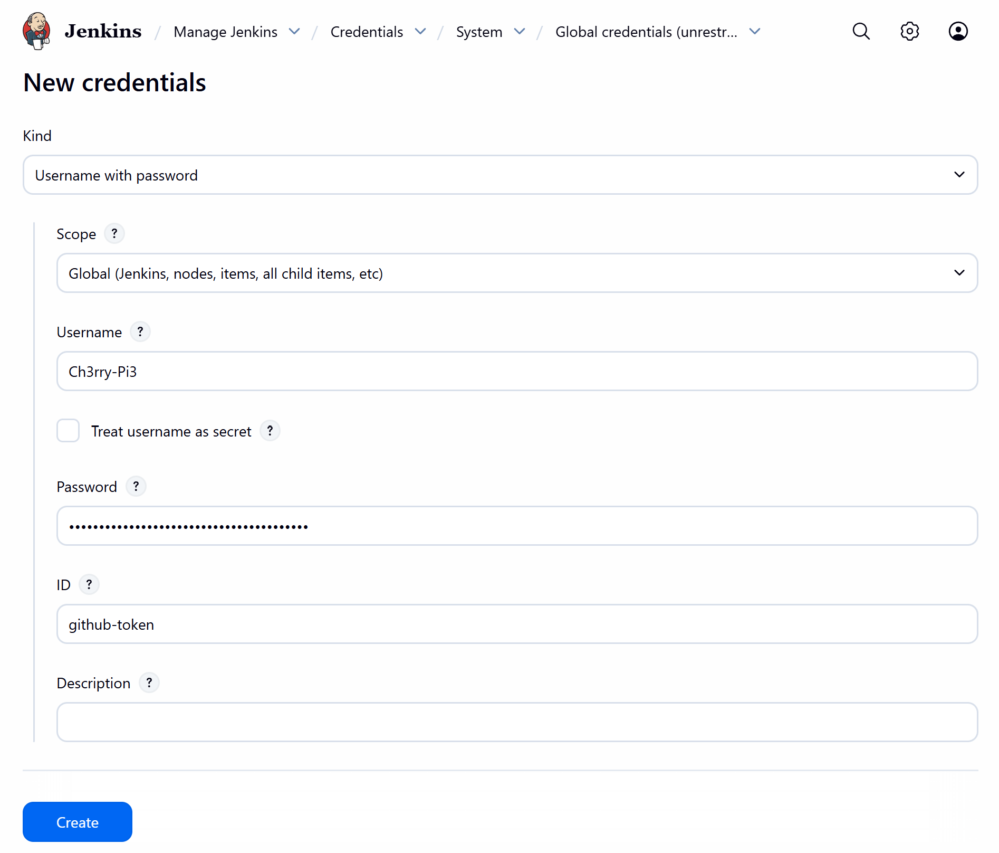
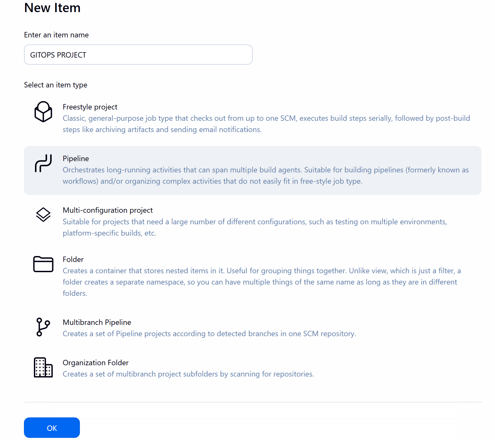
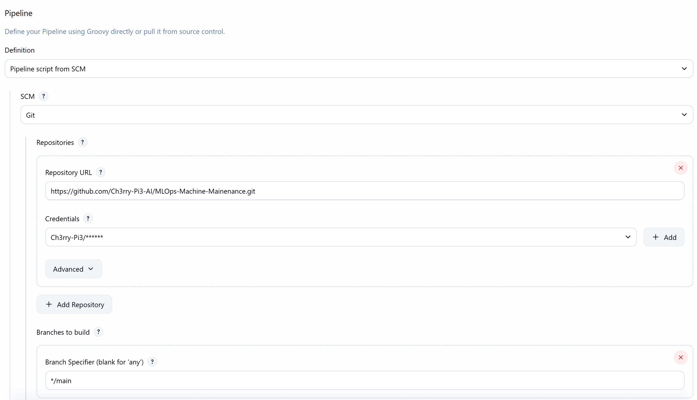
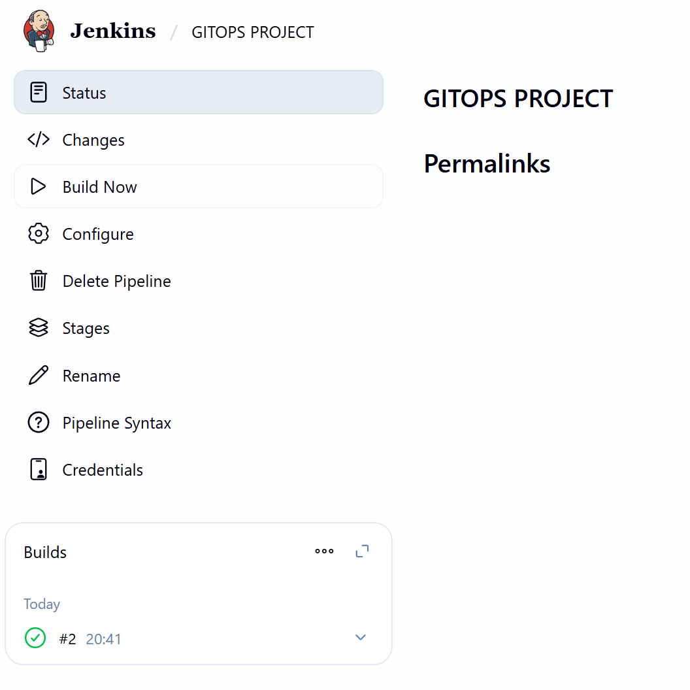

# 🔗 **GitHub Integration with Jenkins (GITOPS Pipeline Setup)**

In this stage, you will integrate your **GitHub repository** with **Jenkins** to automatically pull code into your Jenkins pipeline.
This integration allows Jenkins to access your repository securely using a **Personal Access Token (PAT)** and run automated pipeline builds from your GitHub source.

## 🧩 **1️⃣ Create a GitHub Personal Access Token (PAT)**

1. Go to your **GitHub profile** (not a specific repository).
2. Click on **Settings** → scroll down to **Developer settings**.
3. Under **Personal access tokens**, select **Tokens (classic)**.
4. Click **Generate new token**.

In the **Note** field, enter `github-token`.

Assign the following **permissions**:

* `repo`
* `workflow`
* `admin:org`
* `admin:public_key`
* `admin:repo_hook`
* `admin:org_hook`

<p align="center">
  
</p>

Click **Generate token** and **copy** the token displayed.
Keep this page open — you will need the token for Jenkins credentials shortly.

## ⚙️ **2️⃣ Add GitHub Credentials in Jenkins**

1. Go back to your **Jenkins dashboard**.
2. Navigate to **Manage Jenkins** → **Credentials**.
3. Click on **(global)** to open the global credentials store.

<p align="center">
  
</p>

4. Click **Add Credentials** and fill out the fields as follows:

   * **Username:** Your GitHub username
   * **Password:** Paste the GitHub token you generated earlier
   * **ID:** `github-token`

<p align="center">
  
</p>

Click **Create** to save the credentials.

## 🚀 **3️⃣ Create a New Jenkins Pipeline**

1. From the **Jenkins Dashboard**, click **+ New Item**.
2. Name your pipeline **GITOPS PROJECT**.
3. Select **Pipeline** and click **OK**.

<p align="center">
  
</p>

## 🧠 **4️⃣ Configure the Pipeline to Use GitHub**

In the new pipeline configuration page:

1. Scroll down to the **Pipeline** section.
2. Under **Definition**, select **Pipeline script from SCM**.
3. Choose **Git** from the **SCM** dropdown.
4. Go to your GitHub repository and click the **Code** dropdown, then copy the **HTTPS URL**.
5. Paste this URL in the **Repository URL** field.
6. Under **Credentials**, select the credential you just added (`github-token`).
7. Change the **Branch Specifier** from `*/master` to `*/main`.

<p align="center">
  
</p>

Click **Apply** and then **Save**.

## 🧩 **5️⃣ Generate a Jenkins Pipeline Script**

From your new pipeline page, in the left sidebar, click **Pipeline Syntax**.

1. In the **Sample Step** dropdown, select:
   `checkout: Check out from version control`
2. Fill in the same **repository URL**, **branch**, and **credentials** as before.
3. Click **Generate Pipeline Script**.
4. Copy the generated code — you’ll use it shortly inside your Jenkinsfile.

## 🧱 **6️⃣ Create a Jenkinsfile in Your Repository**

Back in your **VM terminal**, navigate to your project folder and create a new Jenkinsfile:

```bash
vi Jenkinsfile
```

Paste the following pipeline structure:

```groovy
pipeline {
    agent any
    stages {
        stage('Checkout Github') {
            steps {
                echo 'Checking out code from GitHub...'
        	    checkout scmGit(branches: [[name: '*/main']], extensions: [], userRemoteConfigs: [[credentialsId: 'github-token', url: 'https://github.com/Ch3rry-Pi3-AI/MLOps-Machine-Mainenance.git']])
		    }
        }        
        stage('Build Docker Image') {
            steps {
                echo 'Building Docker image...'
            }
        }
        stage('Push Image to DockerHub') {
            steps {
                echo 'Pushing Docker image to DockerHub...'
            }
        }
        stage('Install Kubectl & ArgoCD CLI') {
            steps {
                echo 'Installing Kubectl and ArgoCD CLI...'
            }
        }
        stage('Apply Kubernetes & Sync App with ArgoCD') {
            steps {
                echo 'Applying Kubernetes and syncing with ArgoCD...'
            }
        }
    }
}
```

In **line 6**, replace the code inside the `checkout scmGit(...)` block with the one generated by Jenkins in the previous step.

When done, press `Esc` and type:

```
:wq!
```

to save and exit.

## 🔧 **7️⃣ Configure Git for Commits**

Set your global Git identity:

```bash
git config --global user.email "<your email>"
git config --global user.name "<your name>"
```

Then push your new Jenkinsfile to the remote repository:

```bash
git add .
git commit -m "commit"
git push origin main
```

When prompted:

* Enter your **GitHub username**
* For **password**, paste your **Personal Access Token**

## 🚀 **8️⃣ Run the Jenkins Build**

1. Go back to your **Jenkins dashboard**.
2. Click on your **GITOPS PROJECT** pipeline.
3. Click **Build Now**.

After a successful build, you will see a **green tick** next to the build number, confirming success.

<p align="center">
  
</p>

## ✅ **9️⃣ Summary**

You have successfully:

* Created a **GitHub Personal Access Token** with proper permissions
* Added the token as a **Jenkins credential**
* Configured a **Jenkins pipeline** to pull code directly from GitHub
* Created a **Jenkinsfile** to automate the build stages
* Verified the integration through a successful Jenkins build

Your **GitHub–Jenkins integration** is now fully operational, forming the foundation for continuous integration in your **MLOps Machine Maintenance** project.
