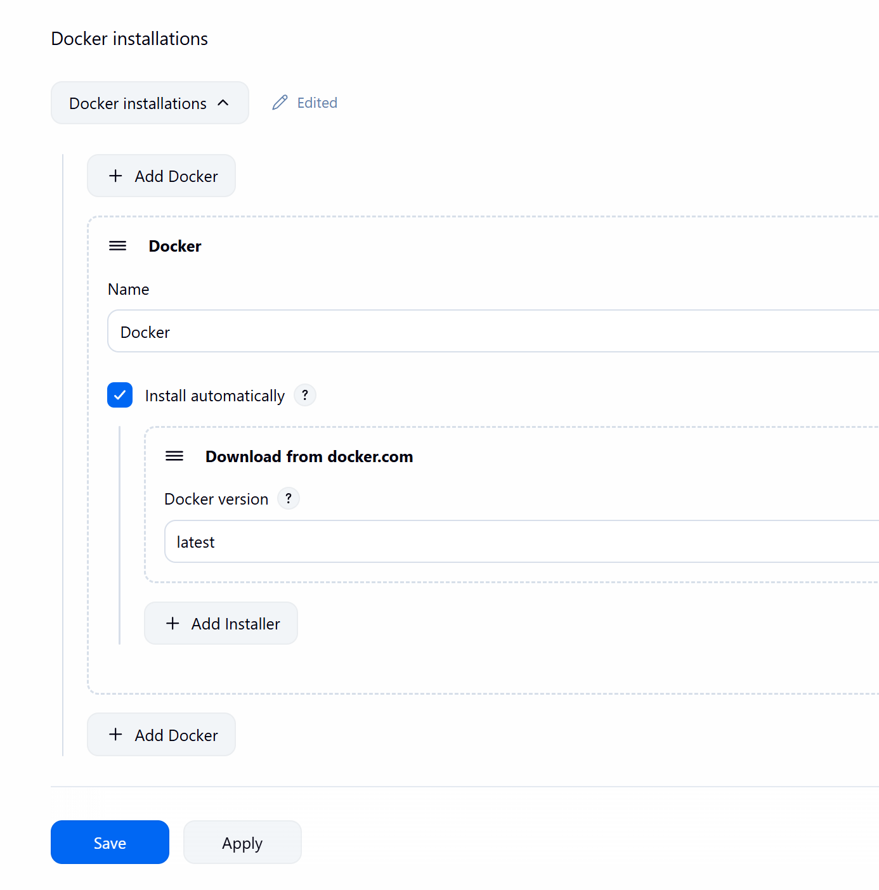
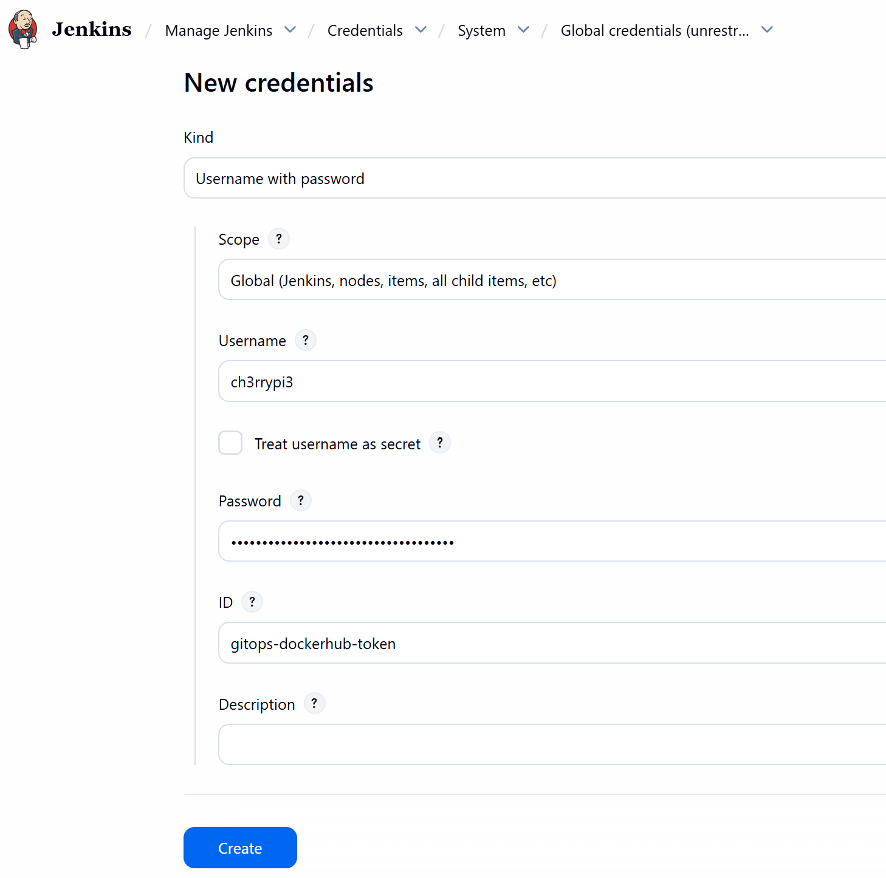

# 🐳 **Building and Pushing Docker Images to DockerHub via Jenkins**

In this stage, you will build your **Docker image** from the MLOps Machine Maintenance project and push it to your **DockerHub repository** using Jenkins automation.
This step ensures that your image is stored in a secure container registry and ready for deployment to your Kubernetes cluster.

## 🧩 **1️⃣ Configure Docker in Jenkins Tools**

1. Go to your **Jenkins Dashboard**.
2. Navigate to **Manage Jenkins → Tools**.
3. Scroll down and click **+ Add Docker**.
4. Enter the configuration details as shown below:

<p align="center">
  
</p>

5. Click **Apply** and **Save**.
   This enables Docker integration for Jenkins pipelines.

## 🐋 **2️⃣ Create a Repository in DockerHub**

1. Go to **[DockerHub](https://hub.docker.com)** and sign in.
2. Click **Create Repository**.
3. Enter the repository name: **`gitops-project`**.
4. Click **Create**.

This repository will store your built Docker images.

## 🔑 **3️⃣ Generate a DockerHub Personal Access Token**

1. In DockerHub, click your **profile icon** → **Account Settings** → **Security** → **Personal Access Tokens**.
2. Click **Generate new token**.
3. Name the token **`gitops-project`**.
4. Set **Access permissions** to **Read, Write, Delete**.
5. Click **Generate** and **copy** the token shown.

Keep this token safe — it will be used in Jenkins credentials.

## ⚙️ **4️⃣ Add DockerHub Credentials to Jenkins**

1. Return to your **Jenkins Dashboard**.
2. Navigate to **Manage Jenkins → Credentials**.
3. Under **Stores scoped to Jenkins**, click **(global)**.
4. Select **+ Add Credentials** and enter:

* **Username:** Your DockerHub username
* **Password:** Paste your DockerHub token
* **ID:** `gitops-dockerhub-token`

<p align="center">
  
</p>

5. Click **Create** to save the credentials.

## 🧱 **5️⃣ Update the Jenkinsfile for Docker Build and Push**

Now open the **Jenkinsfile** in your local **VS Code** project and use the following configuration:

```groovy
pipeline {
    agent any
    environment {
        DOCKER_HUB_REPO = "your-dockerhub-username/gitops-project"
        DOCKER_HUB_CREDENTIALS_ID = "gitops-dockerhub-token"
    }
    stages {
        stage('Checkout Github') {
            steps {
                echo 'Checking out code from GitHub...'
        	    checkout scmGit(branches: [[name: '*/main']], extensions: [], userRemoteConfigs: [[credentialsId: 'github-token', url: 'https://github.com/your-github-username/MLOps-Machine-Mainenance.git']])
		    }
        }        
        stage('Build Docker Image') {
            steps {
                script {
                    echo 'Building Docker image...'
                    dockerImage = docker.build("${DOCKER_HUB_REPO}:latest")
                }
            }
        }
        stage('Push Image to DockerHub') {
            steps {
                script {
                    echo 'Pushing Docker image to DockerHub...'
                    docker.withRegistry('https://registry.hub.docker.com' , "${DOCKER_HUB_CREDENTIALS_ID}") {
                        dockerImage.push('latest')
                    }
                }
            }
        }
        stage('Install Kubectl & ArgoCD CLI') {
            steps {
                echo 'Installing Kubectl and ArgoCD CLI...'
            }
        }
        stage('Apply Kubernetes & Sync App with ArgoCD') {
            steps {
                echo 'Applying Kubernetes and syncing with ArgoCD...'
            }
        }
    }
}
```

### ⚠️ Make sure to update:

* `your-dockerhub-username` → your actual **DockerHub username**
* `your-github-username` → your actual **GitHub username**

## 🧾 **6️⃣ Update the Deployment Image in Kubernetes Manifest**

Open your **`manifests/deployment.yaml`** file and update the image name to match your DockerHub repository:

```yaml
image: your-dockerhub-username/gitops-project:latest
```

This ensures Kubernetes pulls the correct image from your DockerHub account.

## 🔁 **7️⃣ Push the Changes to GitHub**

After updating the Jenkinsfile and manifest, push the changes to your GitHub repository:

```bash
git add .
git commit -m "Added DockerHub build and push stages to Jenkins pipeline"
git push origin main
```

Then, in your **VM instance terminal**, pull the latest updates:

```bash
git pull origin main
```

## 🚀 **8️⃣ Run the Jenkins Pipeline**

1. Open your **Jenkins Dashboard**.
2. Click on your **GITOPS PROJECT** pipeline.
3. Select **Build Now**.

If everything is configured correctly, Jenkins will:

* Build the Docker image locally
* Authenticate with DockerHub using your credentials
* Push the image to your DockerHub repository

A **green checkmark** next to the build indicates a successful run.

## ✅ **9️⃣ Summary**

You have successfully:

* Configured Docker in Jenkins
* Created a **DockerHub repository** and **personal access token**
* Stored DockerHub credentials securely in Jenkins
* Adapted the Jenkinsfile for **automated Docker build and push**
* Verified integration with a successful Jenkins pipeline execution

Your Docker image is now hosted on **DockerHub**, ready for deployment to your **Kubernetes cluster** in the next stage of the MLOps Machine Maintenance pipeline.
