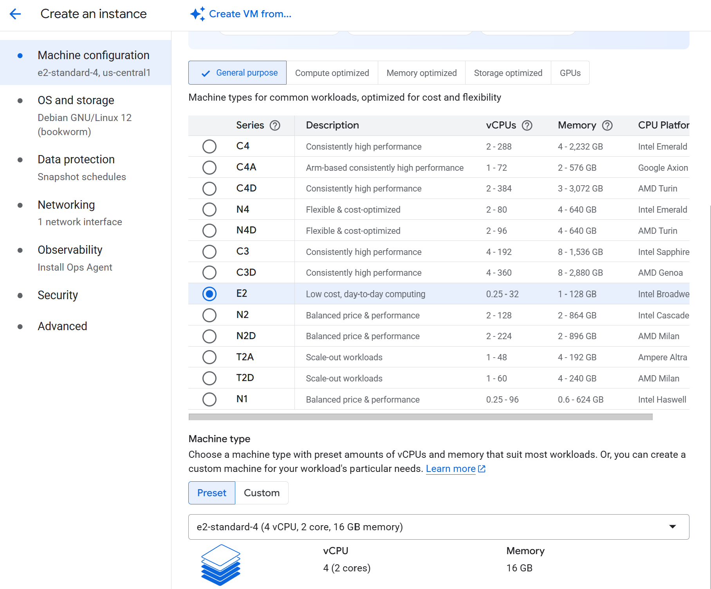
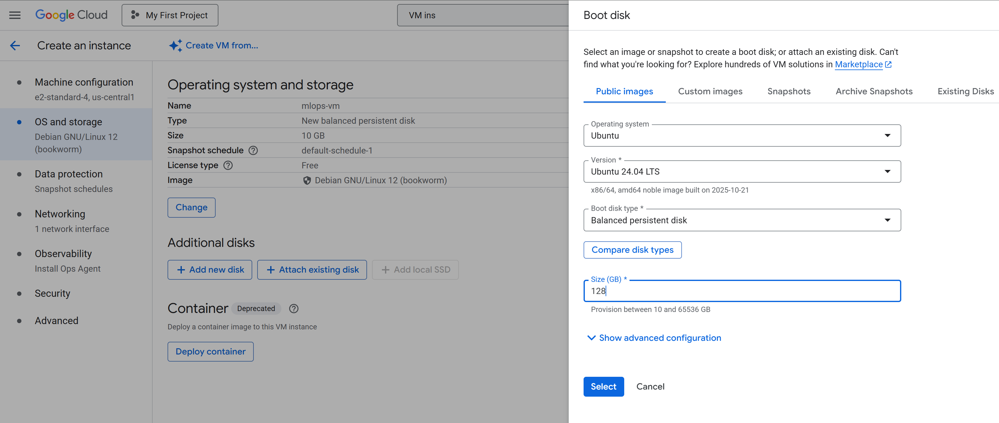
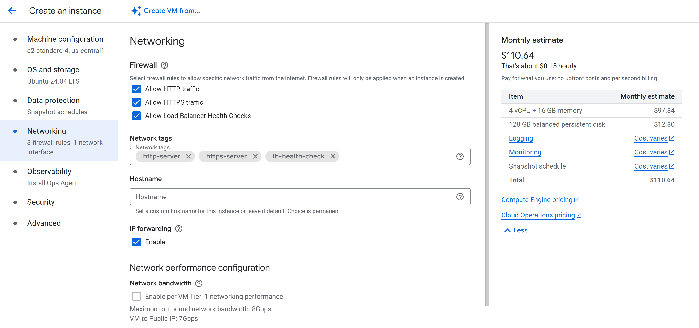
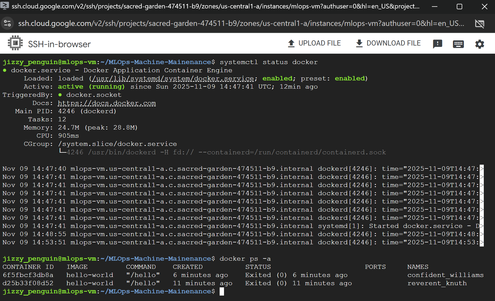

# ☁️ **Google Cloud Platform (GCP) Virtual Machine & Docker Setup**

This stage guides you through **setting up a Google Cloud Platform (GCP) Virtual Machine instance** and **installing Docker** on it.
Once completed, you’ll have a fully functional VM capable of running and building Docker containers for your **MLOps Machine Maintenance** project.


## 🧩 **1️⃣ Create or Sign In to Your GCP Account**

1. Go to [https://cloud.google.com](https://cloud.google.com)
2. Sign in or create a Google Cloud account.
3. In the **Search bar**, type **“VM instances”** and select the service.
4. Click **+ CREATE INSTANCE**.


## ⚙️ **2️⃣ Configure Your VM Instance**

### Name and Region

* **Name:** `mlops-vm`
* **Region:** `us-central1 (Iowa)`

### Machine Configuration

Use the following setup:

<p align="center">
  
</p>

### OS and Storage

Under **OS and storage**, click **Change**, and select:

<p align="center">
  
</p>


### Networking

Open the **Networking** section and set it up as follows:

<p align="center">
  
</p>


Once all settings match, click **Create** to launch your instance.


## 💻 **3️⃣ Connect to Your Instance**

After your instance is ready:

1. Under **Connect**, click the dropdown next to **SSH**
2. Select **“Open in browser window”**

This opens a browser-based terminal directly connected to your new VM.


## 🔗 **4️⃣ Clone Your GitHub Repository**

On your GitHub repository page:

1. Click the **<> Code** button
2. Select **HTTPS**
3. Copy your repository URL

Now, in your VM terminal, type:

```bash
git clone <Your URL>
cd <Your repo name>
```


## 🐳 **5️⃣ Install Docker**

Open [Docker’s official Ubuntu installation guide](https://docs.docker.com/engine/install/ubuntu/) in your browser for reference.
Then copy and paste the following commands into your VM terminal:

```bash
# Add Docker's official GPG key:
sudo apt-get update
sudo apt-get install ca-certificates curl
sudo install -m 0755 -d /etc/apt/keyrings
sudo curl -fsSL https://download.docker.com/linux/ubuntu/gpg -o /etc/apt/keyrings/docker.asc
sudo chmod a+r /etc/apt/keyrings/docker.asc

# Add the repository to Apt sources:
echo \
  "deb [arch=$(dpkg --print-architecture) signed-by=/etc/apt/keyrings/docker.asc] https://download.docker.com/linux/ubuntu \
  $(. /etc/os-release && echo "${UBUNTU_CODENAME:-$VERSION_CODENAME}") stable" | \
  sudo tee /etc/apt/sources.list.d/docker.list > /dev/null

sudo apt-get update
```

Now install Docker:

```bash
sudo apt-get install docker-ce docker-ce-cli containerd.io docker-buildx-plugin docker-compose-plugin
```

When prompted, press **Y** to confirm.

## 🧪 **6️⃣ Verify Docker Installation**

Run the Docker test image:

```bash
sudo docker run hello-world
```

If installed successfully, you should see:

```bash
Unable to find image 'hello-world:latest' locally
latest: Pulling from library/hello-world
17eec7bbc9d7: Pull complete 
Digest: sha256:56433a6be3fda188089fb548eae3d91df3ed0d6589f7c2656121b911198df065
Status: Downloaded newer image for hello-world:latest

Hello from Docker!
This message shows that your installation appears to be working correctly.

To generate this message, Docker took the following steps:
 1. The Docker client contacted the Docker daemon.
 2. The Docker daemon pulled the "hello-world" image from the Docker Hub.
    (amd64)
 3. The Docker daemon created a new container from that image which runs the
    executable that produces the output you are currently reading.
 4. The Docker daemon streamed that output to the Docker client, which sent it
    to your terminal.

To try something more ambitious, you can run an Ubuntu container with:
 $ docker run -it ubuntu bash

Share images, automate workflows, and more with a free Docker ID:
 https://hub.docker.com/

For more examples and ideas, visit:
 https://docs.docker.com/get-started/
```


## ⚙️ **7️⃣ Configure Docker for Non-Root Access**

Open [Docker’s Linux post-installation guide](https://docs.docker.com/engine/install/linux-postinstall/).
Copy and paste the following commands in your VM terminal:

```bash
sudo groupadd docker
sudo usermod -aG docker $USER
newgrp docker
docker run hello-world
```

This ensures Docker commands can be run **without `sudo`**.


## 🧩 **8️⃣ Enable Docker Services**

To enable Docker to start on system boot:

```bash
sudo systemctl enable docker.service
sudo systemctl enable containerd.service
```


## ✅ **9️⃣ Confirm Installation**

Check Docker’s status:

```bash
systemctl status docker
```

Press **q** to exit, then verify active containers with:

```bash
docker ps -a
```

If everything is set up correctly, you should see:

<p align="center">
  
</p>


🎉 **You’ve successfully set up your GCP VM and installed Docker!**
You can now use this virtual machine to **build**, **test**, and **deploy** your containerised MLOps Machine Maintenance application.
