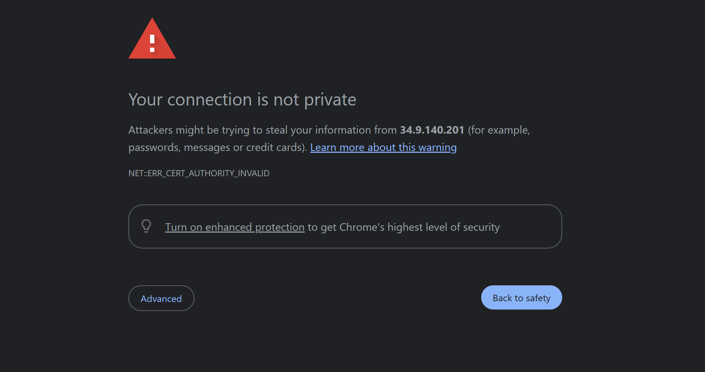
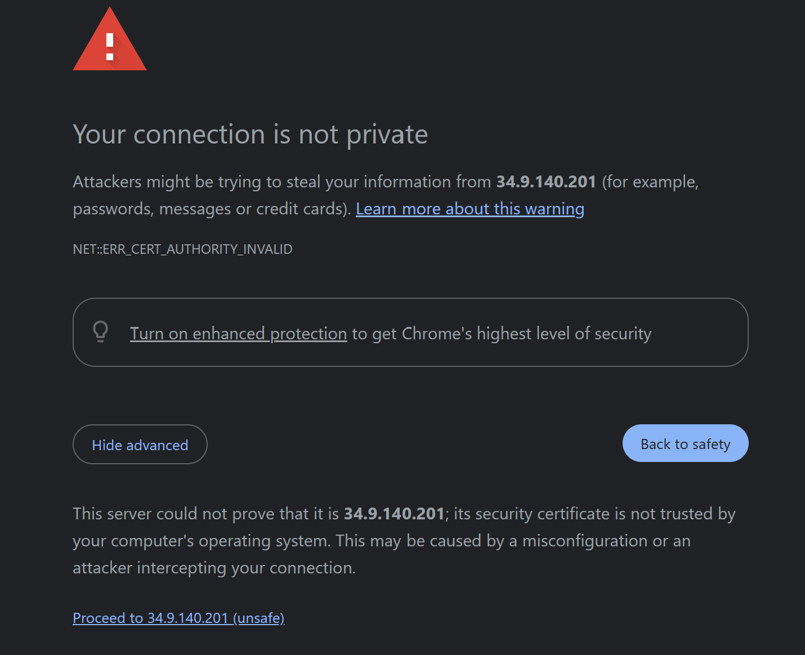
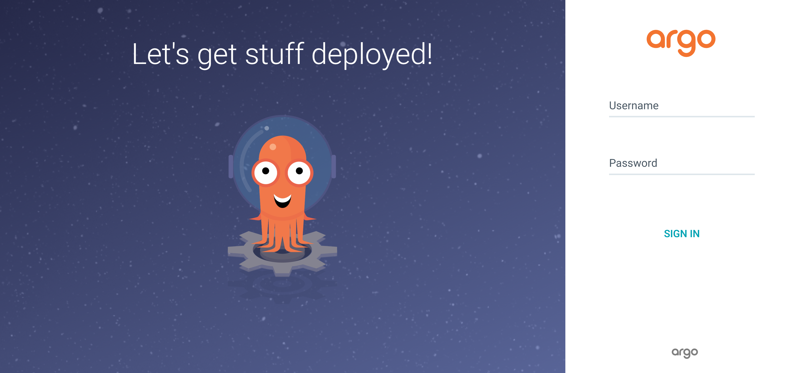
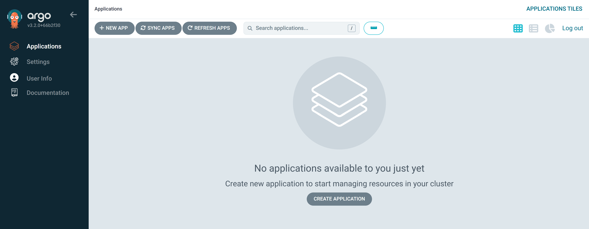
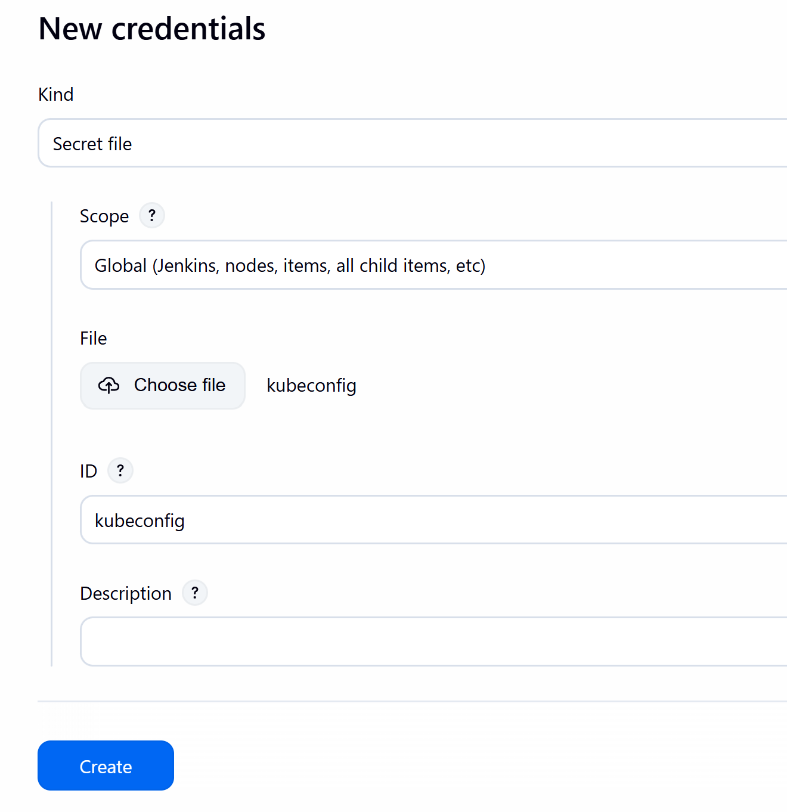
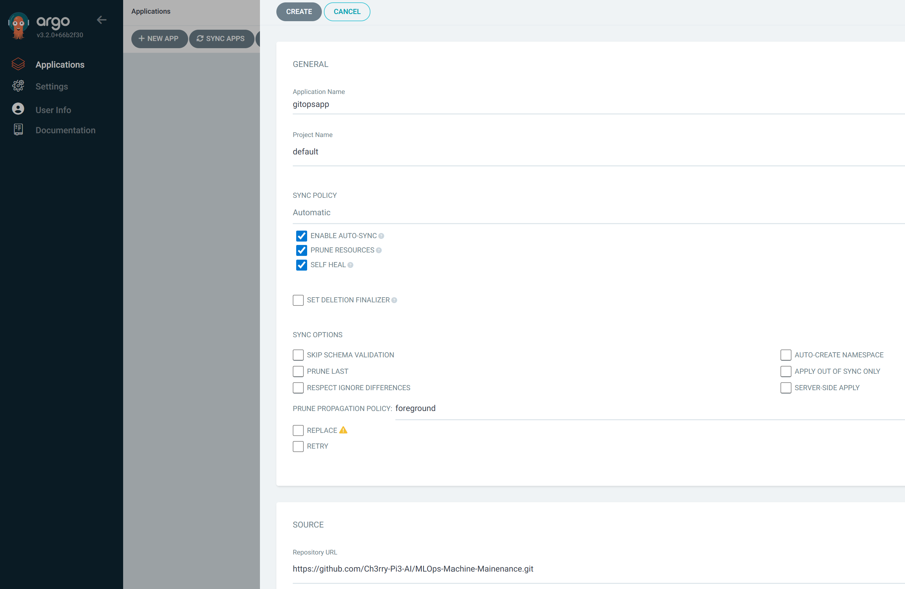
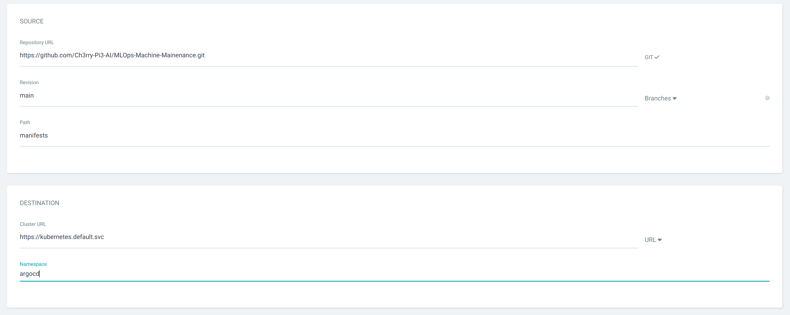
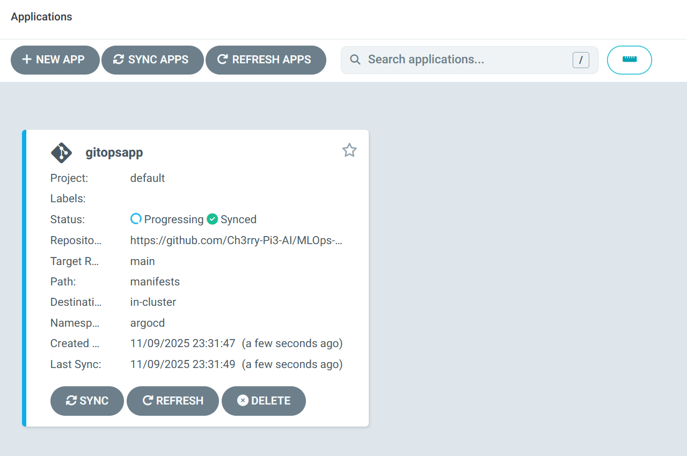
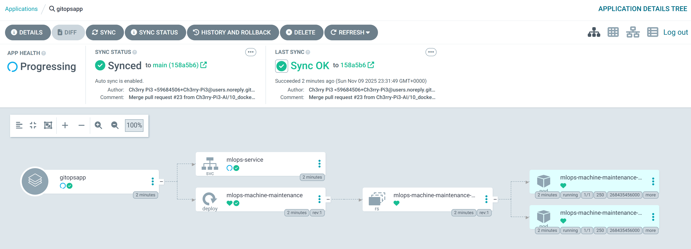

# 🚀 **Continuous Deployment (CD) with ArgoCD — MLOps Machine Maintenance**

With the previous stage complete, your **Continuous Integration (CI)** pipeline is now operational.
This stage focuses on implementing **Continuous Deployment (CD)** by installing and configuring **ArgoCD** — a powerful GitOps tool that automates application deployment to Kubernetes.

---

## 🧩 **1️⃣ Verify Existing Kubernetes Namespaces**

Before installing ArgoCD, check your current namespaces:

```bash
kubectl get namespace
```

**Output:**

```bash
NAME              STATUS   AGE
default           Active   6h13m
kube-node-lease   Active   6h13m
kube-public       Active   6h13m
kube-system       Active   6h13m
```

---

## 🧠 **2️⃣ Create a Namespace for ArgoCD**

Run the following command:

```bash
kubectl create ns argocd
```

**Output:**

```bash
namespace/argocd created
```

---

## ⚙️ **3️⃣ Install ArgoCD**

Now install ArgoCD and its components inside the `argocd` namespace:

```bash
kubectl apply -n argocd -f https://raw.githubusercontent.com/argoproj/argo-cd/stable/manifests/install.yaml
```

Once complete, check all ArgoCD resources:

```bash
kubectl get all -n argocd
```

You should see something similar to:

```bash
NAME                                                    READY   STATUS    RESTARTS   AGE
pod/argocd-application-controller-0                     1/1     Running   0          84s
pod/argocd-applicationset-controller-7b6ff755dc-b489w   1/1     Running   0          84s
pod/argocd-dex-server-584f7d88dc-mzgdd                  1/1     Running   0          84s
pod/argocd-notifications-controller-67cdd486c6-fcw7w    1/1     Running   0          84s
pod/argocd-redis-6dbb9f6cf4-rqk4c                       1/1     Running   0          84s
pod/argocd-repo-server-57bdcb5898-4pvjc                 1/1     Running   0          84s
pod/argocd-server-57d9cc9bcf-brndd                      1/1     Running   0          84s
```

✅ All pods must show **STATUS: Running** and **READY: 1/1**.

---

## 🌐 **4️⃣ Change ArgoCD Service Type to NodePort**

By default, the ArgoCD server uses **ClusterIP**, which is only accessible internally.
We will change it to **NodePort** to make it accessible externally.

```bash
kubectl edit svc argocd-server -n argocd
```

Find the line:

```
type: ClusterIP
```

Replace it with:

```
type: NodePort
```

Then press `Esc`, type `:wq!`, and hit Enter to save.

Verify the change:

```bash
kubectl get svc -n argocd
```

**Output:**

```bash
NAME                                      TYPE        CLUSTER-IP       EXTERNAL-IP   PORT(S)                      AGE
argocd-applicationset-controller          ClusterIP   10.110.183.134   <none>        7000/TCP,8080/TCP            12m
argocd-dex-server                         ClusterIP   10.96.53.58      <none>        5556/TCP,5557/TCP,5558/TCP   12m
argocd-server                             NodePort    10.103.90.51     <none>        80:30756/TCP,443:32227/TCP   12m
```

Confirm **TYPE** is now **NodePort** for `argocd-server`.

---

## 🔁 **5️⃣ Forward Port for External Access**

Now expose the ArgoCD server port externally:

```bash
kubectl port-forward --address 0.0.0.0 service/argocd-server 32227:80 -n argocd
```

(Replace `32227` with your actual NodePort number from the previous step.)

**Output:**

```bash
Forwarding from 0.0.0.0:32227 -> 8080
Handling connection for 32227
```

Keep this terminal open — it must stay running.

---

## 🌍 **6️⃣ Access ArgoCD in the Browser**

Copy your **External IP** from your GCP VM instance and paste it into your browser, followed by your NodePort (e.g. `:32227`).

Example:

```
http://34.9.140.201:32227/
```

When you first connect, you’ll see a browser warning:

<p align="center">
  
</p>

Click **Advanced**, then **Proceed to <your external IP> (unsafe)**:

<p align="center">
  
</p>

You’ll now see the **ArgoCD login screen**:

<p align="center">
  
</p>

---

## 🔑 **7️⃣ Retrieve the ArgoCD Admin Password**

In a new SSH terminal connected to your VM:

```bash
kubectl get secret -n argocd argocd-initial-admin-secret -o jsonpath="{.data.password}" | base64 -d
```

Copy the generated alphanumeric string — this is your **ArgoCD admin password**.
Return to the login screen and enter:

* **Username:** `admin`
* **Password:** your copied password

You’ll then see the **ArgoCD Dashboard**:

<p align="center">
  
</p>

---

## 🧠 **8️⃣ Configure kubeconfig for Jenkins**

Navigate to your VM home directory:

```bash
cd ..
ls -la
```

You should see a `.kube` folder. Inspect it:

```bash
ls -la .kube/
```

**Output:**

```bash
total 16
drwxr-xr-x 3 user docker 4096 ...
-rw------- 1 user docker  848 ...
```

View the config file:

```bash
cat .kube/config
```

Copy the contents into a new **Notepad file** on your local machine.

Now, make the following edits:

* Change `certificate-authority` → `certificate-authority-data`
* Change `client-certificate` → `client-certificate-data`
* Change `client-key` → `client-key-data`

Replace each value (after the colons) with base64-encoded equivalents from these commands:

```bash
cat /home/<your-username>/.minikube/ca.crt | base64 -w 0; echo
cat /home/<your-username>/.minikube/profiles/minikube/client.crt | base64 -w 0; echo
cat /home/<your-username>/.minikube/profiles/minikube/client.key | base64 -w 0; echo
```

Copy each output back into your local Notepad config.

---

## 💾 **9️⃣ Create kubeconfig File Locally**

On your local computer, open **Git Bash**:

```bash
cd Downloads
vi kubeconfig
```

Press `i` and paste the entire edited config file contents.
Then press `Esc` and type `:wq!` to save and exit.

This creates a **kubeconfig** system file (not a `.txt`).

---

## 🔐 **🔟 Upload kubeconfig to Jenkins**

Go to your **Jenkins Dashboard → Manage Jenkins → Credentials → (global)**
Click **+ Add Credentials**.
In the **Kind** dropdown, select **Secret file**, then upload your new `kubeconfig` file.

* **ID:** `kubeconfig`

<p align="center">
  
</p>

Click **Create**.

---

## ⚙️ **1️⃣1️⃣ Generate Jenkins Pipeline Step for Kubernetes**

From your **Jenkins pipeline configuration**, click **Pipeline Syntax**.
In **Sample Step**, choose `kubeconfig: Setup Kubernetes CLI (kubectl)`.

Now, get your Kubernetes endpoint:

```bash
kubectl cluster-info
```

**Output:**

```bash
Kubernetes control plane is running at https://192.168.49.2:8443
CoreDNS is running at https://192.168.49.2:8443/api/v1/namespaces/kube-system/services/kube-dns:dns/proxy
```

Copy the **first URL** and paste it into the **Kubernetes server endpoint** field in Jenkins.
Select your credential (`kubeconfig (kubeconfig)`) and **Generate Pipeline Script**.

---

## 🧾 **1️⃣2️⃣ Configure ArgoCD Repository Connection**

In your ArgoCD dashboard:

1. Go to **Settings → Repositories → + Connect Repo**
2. Switch **VIA SSH** → **VIA HTTP/HTTPS**
3. Fill out the fields:

   * **Name:** Github
   * **Project:** default
   * **Repository URL:** *Your GitHub repo URL*
   * **Username:** *Your GitHub username*
   * **Password:** *Your GitHub Personal Access Token*
4. Click **Connect**

---

## 🧱 **1️⃣3️⃣ Create ArgoCD Application**

Go to **Applications → + NEW APP** and configure:

**General:**

* **Application Name:** gitopsapp
* **Project Name:** default
* Enable ✅ **PRUNE RESOURCES** and ✅ **SELF HEAL**

**Source:**

* **Repository URL:** select your GitHub repo URL
* **Revision:** `main`
* **Path:** `manifests`

<p align="center">
  
</p>

<p align="center">
  
</p>

Click **Create**.
You should now see your app listed:

<p align="center">
  
</p>

Click on it to see deployment details:

<p align="center">
  
</p>

---

## 🔄 **1️⃣4️⃣ Run Jenkins Pipeline and Deploy**

Ensure all your latest code changes have been pushed to GitHub.
Then re-run your Jenkins pipeline.
ArgoCD will automatically detect the changes and deploy them to your Minikube cluster.

---

## 🌐 **1️⃣5️⃣ Expose Your Flask App Externally**

To make your application publicly accessible, run:

```bash
minikube tunnel
```

**Output:**

```bash
Status:
        machine: minikube
        pid: 412124
        route: 10.96.0.0/12 -> 192.168.49.2
        minikube: Running
        services: [mlops-service]
    errors: 
                minikube: no errors
                router: no errors
                loadbalancer emulator: no errors
```

In another terminal, forward your application’s service port:

```bash
kubectl port-forward svc/mlops-service -n argocd --address 0.0.0.0 9090:80
```

Now open your browser and navigate to:

```
http://<your-external-ip>:9090/
```

You should now see your **MLOps Machine Maintenance Flask app** live and accessible from the internet.

<p align="center">
  
</p>

---

## ✅ **Summary**

You have successfully completed the **Continuous Deployment (CD)** setup with **ArgoCD**:

* Installed and configured ArgoCD in Kubernetes
* Connected Jenkins, Kubernetes, and ArgoCD together
* Created a GitOps workflow for automated deployment
* Deployed your Flask app externally through Minikube

Your full **CI/CD pipeline** is now operational — from **GitHub commit → Jenkins build → DockerHub push → ArgoCD deployment → live application**.
