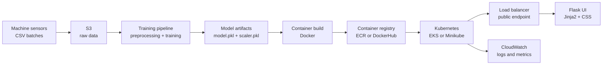
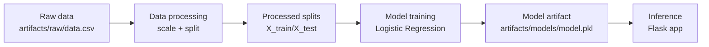
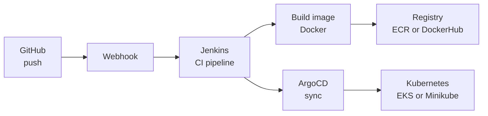

# MLOps Machine Maintenance (AWS-first)

End-to-end MLOps workflow for predictive maintenance, from data prep and training to containerized serving and GitOps delivery on AWS.

<p align="center">
  
</p>

This project turns raw machine telemetry into reliable maintenance signals and deploys them as a production service. It focuses on reproducibility, repeatable training, and automated delivery so the model stays fresh with minimal manual work.

## Benefits
- Reduce unplanned downtime with proactive maintenance signals
- Reproduce training runs with consistent artifacts and logging
- Ship model updates safely with CI/CD and GitOps controls

## Architecture Overview

```mermaid
flowchart LR
    Sensors["Machine sensors
    CSV batches"] --> S3["S3
    raw data"]
    S3 --> Train["Training pipeline
    preprocessing + training"]
    Train --> Artifacts["Model artifacts
    model.pkl + scaler.pkl"]
    Artifacts --> Build["Container build
    Docker"]
    Build --> Registry["Container registry
    ECR or DockerHub"]
    Registry --> Cluster["Kubernetes
    EKS or Minikube"]
    Cluster --> LB["Load balancer
    public endpoint"]
    LB --> UI["Flask UI
    Jinja2 + CSS"]
    Cluster --> Logs["CloudWatch
    logs and metrics"]
```

## Quick Start
1) Install prerequisites:
   - Python 3.10+
   - Docker
   - kubectl
   - A Kubernetes context (Minikube for local or EKS for AWS)
   - Jenkins + ArgoCD if you want the full CI/CD flow

2) Set up a local environment:
```powershell
python -m venv .venv
.\.venv\Scripts\activate
pip install -e .
```

3) Run the training pipeline:
```powershell
python pipeline\training_pipeline.py
```
This reads `artifacts/raw/data.csv`, produces processed splits in `artifacts/processed/`,
and writes the trained model to `artifacts/models/model.pkl`.

4) Start the Flask app locally:
```powershell
python app.py
```
Open `http://localhost:5000` to test predictions.

5) (Optional) Build and run the container:
```powershell
docker build -t mlops-machine-maintenance:local .
docker run -p 5000:5000 mlops-machine-maintenance:local
```

6) (Optional) Deploy to Kubernetes:
```powershell
kubectl apply -f manifests\
kubectl get svc mlops-service -o wide
```
Update `manifests/deployment.yaml` to point at your image in ECR or DockerHub.

## ML Pipeline

```mermaid
flowchart LR
    Raw["Raw data
    artifacts/raw/data.csv"] --> Prep["Data processing
    scale + split"]
    Prep --> Processed["Processed splits
    X_train/X_test"]
    Processed --> Train["Model training
    Logistic Regression"]
    Train --> Model["Model artifact
    artifacts/models/model.pkl"]
    Model --> Serve["Inference
    Flask app"]
```

## CI/CD and GitOps

```mermaid
flowchart LR
    Push["GitHub
    push"] --> Hook["Webhook"]
    Hook --> Jenkins["Jenkins
    CI pipeline"]
    Jenkins --> Build["Build image
    Docker"]
    Build --> Registry["Registry
    ECR or DockerHub"]
    Jenkins --> Argo["ArgoCD
    sync"]
    Argo --> Cluster["Kubernetes
    EKS or Minikube"]
```

## Tech Stack
- Front end: HTML + CSS with Jinja2 templates in `templates/` and `static/`
- Back end: Python + Flask in `app.py`
- ML: pandas, numpy, scikit-learn, joblib
- MLOps: Docker, Kubernetes manifests, Jenkins, ArgoCD, GitHub webhooks
- AWS: S3 for raw data and artifacts, ECR for container images, EKS for serving,
  EC2 for Jenkins and ArgoCD hosts, CloudWatch for logs and metrics, IAM for access control

## Project Structure
- `artifacts/` raw data, processed splits, and trained model artifacts
- `pipeline/` training pipeline runner
- `src/` preprocessing, training, logging, and exception utilities
- `manifests/` Kubernetes deployment and service
- `templates/` Jinja2 HTML templates
- `static/` CSS and UI assets
- `app.py` Flask inference service
- `Dockerfile` container build
- `Jenkinsfile` CI pipeline with ArgoCD sync

## Deployment Notes
- The default image in `manifests/deployment.yaml` points to DockerHub.
  Swap it for your ECR image when targeting AWS.
- The Service type is `LoadBalancer`; on AWS this provisions an ELB or ALB endpoint.
- The Jenkins pipeline assumes DockerHub credentials; update the registry section
  if you are pushing to ECR.

## Guides
- `pipeline/README.md` training pipeline details
- `manifests/README.md` Kubernetes deployment notes
- `src/README.md` core utilities and ML modules
- `templates/README.md` front-end template guide
- `static/README.md` styling and assets
